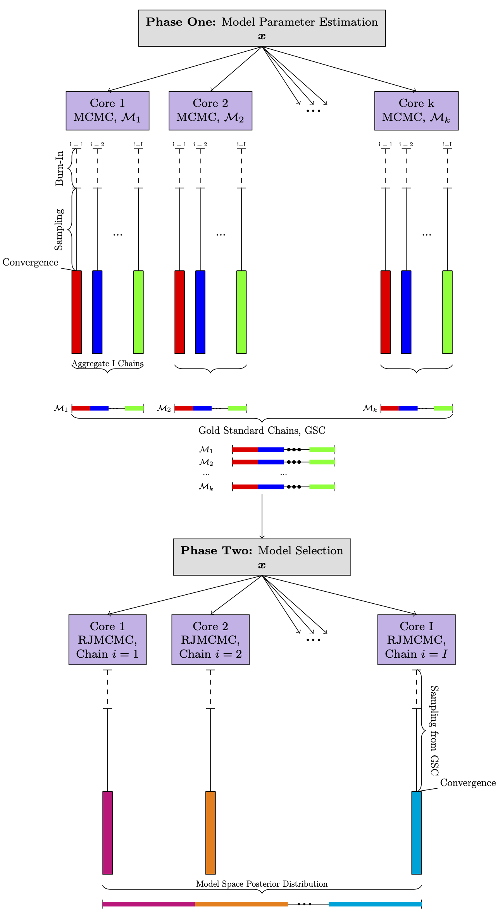

# CU-MSDSp: Cornell University - Model Selection Dependent Search in Parallel 

### Overview 
Oftentimes, researchers must decide which parameterized model best fits the system they are observing. This type of model selection is a challenging problem, whose challenges are further compounded when inferring the associated parameters for each model. The Reversible Jump Markov Chain Monte Carlo (RJMCMC) method is a trans-dimensional Bayesian algorithm that can be used to simultaneously infer the joint distribution o both the model and model-parameter space. CU-MSDSp offers a generalized, parallel implementation of RJMCMC that provides researchers with an accessible, flexible, and objectively reliable approach to inference on the joint model and model parameter space. 

### Objectives 
* Provide an accessible, extendable, reliable RJMCMC software implementation for users to carry out in parallel. 

### Description and Background
CU-MSDSp begins an analysis by infering model paramter distributions for each competing model, in order that these results may subsequently be used to infer the model space probabilities. Specifically, CU-MSDSp first independently forms converged approximations for each of the competing model's parameter joint posterior distribution using the [Stan API](https://mc-stan.org/) interface. The collection of samples corresponding to the converged joint posteriors is referred to as "gold standard chains". These gold standard chains are then used in a parallel RJMCMC algorithm, via Message Passing Interace (MPI), to assess the model probabilities. A schematic of this algorithm is shown below: 



We assume that users have a general background in Bayesian Statistics and Markov Chain Monte Carlo (MCMC) methods. While not necessary, we beleive it beneficial to have some understanding of RJMCMC and refer readers to [Green RJMCMC](how to cite) for more details on this trans-dimensional algorithm. 

### Installation 
#### Dependencies 
* Python Dependicies (can be installed from [here](https://www.scipy.org/install.html))
	* Matplotlib 
 	* Seaborn
	* Numpy 
* C Dependencies 
	* [Message Passing Interface (MPI)](https://www.open-mpi.org/)
	* [GNU Scientific Library](https://www.gnu.org/software/gsl/)
* Bash
	*bc command 
* cmdstan- See [here](https://mc-stan.org/docs/2_24/cmdstan-guide/cmdstan-installation.html#git-clone.section)  for installation instruction and dependencies. 

### Example 
We now walk through a cannoical example used in RJMCMC literature: deciding if a Poisson or Negative Binomial distribution best fits a collection of observational data. The following steps are required to implement CU-MSDSp:

1. **Define Data** 
	Specify the germane observational data within the *data* directory using JSON format (labeled as *data.json*). These data will be referenced by the models written for the Stan API. An example *data.json* file is in within the data directory to aid users. 

2. **Define Models**
	As mentioned prevoiusly, users must define ther models using the stan language. These models should be placed in the *models* directory as *modelname.stan*. The *poisson.stan* and *negativeBinomial.stan* are already defined in the models directory, as an example. 

3. **Define A Config File** 
	A config file is required to run CU-MSDSp. This config file specifies the location of cmdstan directory (for example in ~/.cmdstan), the number of cores needed for the Stan API, the number of chains, samples to run, etc. This is specified as *setup.config* in the home directory of CU-MSDSp. 

4. **Run CU-MSDSp** 
CU-RJMCMp is run in bash as follows:

```bash
sh runParallel.sh
```

CU-MSDSp will output the samples for each gold standard chain in the *goldStandardChains* directory. These results are produced by cmdstan. The results of model selection are collected within the *modelSelection* directory. The chain samples, as well as the corresponding acceptance probability from the simualation, are included within *modelSelection*. We note that users can check MCMC congergence diagnostics by using some of the built-in capabilities of cmdstan. Finally a mapping of the model name and model index will be provided in the home directory as *modelIndex.txt*

5. Visualize Results
Some basic visualization are built into CU-MSDSp. Specifically, parameter histogram and parameter trace plots are provided for each model. In addition, the distribtuion of the model probabilities and the acceptance probabilites are also visualized. The plotting function is specified in the config file, but can be run seperately by 

```bash
python plotMCMCResults.py
```

All results are stored in the *pics* directory. 

### References 
Please see our paper [Software X Paper](A link) for more details on the numerical underpinnings of CU-MSDSp. In addition to the paper, we present our [derivation and proof](https://github.com/jtchavisIII/CU-MSDSp/blob/master/docs/CU_MSDSp_Theoretical_Underpinnings.pdf) of the theoretical foundation that shows that the parallel approach used in CU-MSDSp leads to the same joint model and model-parameter distribution as the standard RJMCMC.
